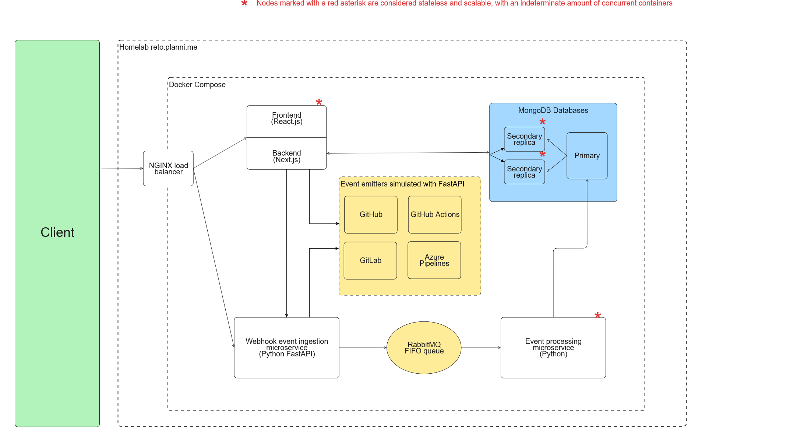

# Reto

## Arquitectura

### Diagrama de componentes

La arquitectura esta diseñada con escalabilidad en mente. Todos excepto un componente son stateless por naturaleza, y se pueden escalar sin limite. Al servicio de ingestion de eventos no alcanzó a ser stateless, pero lo podría ser con una modificación pequeña (discutida despues).

La simulación de eventos se hace con un programa en Python, el cual recibe Webhooks y REST API con respuestas simulando la de los proveedores de nube apropiados. Este es menos desarrollada, por limitaciones de tiempo.

#### NGINX Load balancer

NGINX se utiliza como balanceador de carga. Principalmente, esto es para poder proteger los endpoints del frontend y backend con HTTPS, y lo mismo con el servicio de ingestion de eventos. Ninguna comunicación ocurre con el exterior que no sea a travez de NGINX.

#### Frontend/Backend

El frontend y el backend son implementados en Next.js y React.js. El backend se implementa como API Routes de Next.js, y se cominica principalmente con la base de datos MongoDB, con unas leves conexiones al generador de eventos. 

Esta separación entre backend y frontend es cuidadosa, permitiendo el uso de secretos sin la posibilidad de filtrar estos al exterior. 

El frontend es un SPA simple basado en React.js, usando Bootstrap como librería de UI. Se comunica con el backend a traves de el Fetch API. No tiene autenticación implementada.

#### MongoDB Database
La base de datos MongoDB se escogió debido a la necesidad de poder ingerir una grandisima cantidad de eventos por segundo, y la simplicidad con la cual se puede escalar. La base de datos se configuró como un replica set con un primario y cualquier cantidad de bases de datos secundarias. Sin embargo, en este caso por razones de tiempo se deja comentada la implementación de esta y se simula con un solo nodo, ya que el proceso de registrar nodos en un replica set es mucho mas complejo de automatizar por Docker Compose (en un ambiente de producción esto sería un script simple de implementar).

Se mantienen indices (a veces compuestos) para acelerar las peticiones comunes a la base de datos.

#### Event Ingestion

Para recibir y escuchar los eventos de una gran variedad de servicios, se creó este microservicio. Este servicio expone webhooks para cada uno de los proveedores de nube necesarios, y permite la declaración facil de metodos hechos a la medida de cada servicio. Su rol debería ser minimo, solo debe etiquetar los payloads originales con un timestamp, la plataforma de origen y el tipo de evento. Despues de esto, remite ese payload etiquetado a una cola de espera de RabbitMQ. 

En teoria este servicio se podría modificar facilmente para ser stateless y escalable, solo que toca crear un mecanismo para reducir la cantidad de eventos que puedan llegarle a 2 nodos simultaneamente, sin sobrecargar a RabbitMQ con la solución de duplicados.

#### RabbitMQ

Esta es una cola de espera que gestiona de forma durable los eventos recibidos por el Event-Ingestion. 

#### Event Processing

Este microservicio descola los eventos de la cola de RabbitMQ y los procesa en un formato mas apropiado para meter en MongoDB. Aca se deben homogenizar los esquemas de Commits, PRs, Pipelines, etc a un esquema en común. Por ahora, se extraen unos datos puntuales y se añade el evento original todo en un solo documento de MongoDB. 

Este servicio tambien tiene un proceso bastante simple para permitir la adicion de nuevas plataformas, a traves del folder de `providers/`. Solo es necesario crear un .py que pueda procesar los eventos de la plataforma, y registrar ese proveedor en `/main.py`

#### Event Generation

Este es un servicio mixto de Python y FastAPI que sirve para mockear los eventos y REST Endpoints de los servicios de nube. Tambien es facilmente modificable para añadir nuevos proveedores. Un subproceso de Python esta encargado de generar periodicamente (con un periodo configurable por variables de entorno) cualquier tipo de evento disponible. El subproceso de FastAPI mockea REST API endpoints de los servicios con payloads similares a lo esperado. 

<mark>Este contenedor produce datos periodicamente. Para evitar llenar la base de datos, recordar cerrarlo, o ajustar el periodo de generación.</mark>

## Despliegue

El proyecto está creado para poder ser desplegado facilmente con Docker Compose, y todos sus elementos estan contenerizados, con variables de entorno para configurarlos. En teoría (contactenme si tienen problemas, lo he probado en 2 máquinas), correr el proyecto solo requiere jalar el repositorio (`git clone https://github.com/RetoBancolombia/Reto.git`) y el comando:

`docker compose --profile backend up`

En el caso de que se hagan cambios en el codigo, o se haga un `git pull` posterior, será necesario añadir la instrucción `--build` al comando de Docker Compose

NGINX todavia no esta correctamente configurado, es lo unico. Sin embargo, todos los demas servicios deberian funcionar sobre localhost. Si se desea mayor seguridad (la cual quité por razones de desarrollo rapido), se pueden remover las instrucciones de `ports:` en todos los contenedores salvo `frontend` y  `nginx`. Unas complicaciones con mi servidor personal no me dejaron alcanzar a probar la segregacion de usuarios ocn privilegios limitados o la limitación de recursos. 

Si lo logro desplegar (lo cual no prometo, debido a esos problemas previamente mencionados, lo desplegare en `https://reto.planni.me`)

## Consideraciones

La escala del proyecto fue masiva, y tuve varios inconvenientes personales esta semana. Hasta la fecha, he entregado un producto minimo, pero con la arquitectura funcionando. Ya faltaria crecer la robustez de los servicios, mejorar el despliegue CI/CD y terminar de implementar todos los proveedores. No duden en contactarme con cualquier duda.